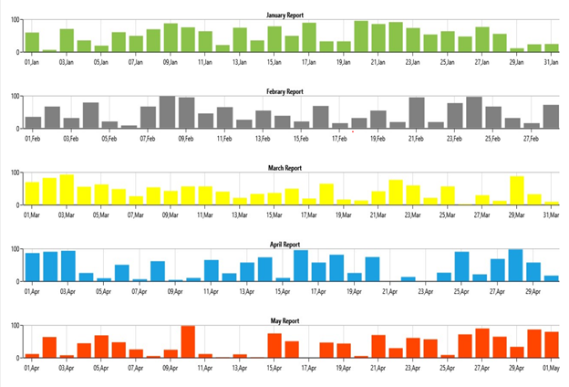

# How to export the multiple WPF Chart
This article describes how to export all used Syncfusion [WPF Chart](https://www.syncfusion.com/wpf-controls/charts) controls into single page of pdf format as shown in below.


 
By default, SfChart supports the printing that enables you to print each chart at a time by calling Print method. Considering the use case that your page has ‘n’ number of charts and wants to print it in single page of pdf format then, please follow the below steps.

**Step 1:** Create an SfChart sample with all the necessary assemblies.
Refer to this Getting started documentation to create a simple SfChart sample and configure it.

**Step 2:** Add Pdf assemblies in the chart sample and configure it by using the Pdf user guide document.
 
**Step 3:** Add multiple SfChart in the grid panel.
```
<Grid Margin="0, 10, 0, 0">

        <Grid.RowDefinitions>
            <RowDefinition Height="2*"/>
            <RowDefinition Height="2*"/>
            <RowDefinition Height="2*"/>
            <RowDefinition Height="2*"/>
            <RowDefinition Height="2*"/>
            <RowDefinition Height="100"/>
        </Grid.RowDefinitions>
        <StackPanel Grid.Row="0">

            <syncfusion:SfChart Background="White" x:Name="chart1" FontWeight="Bold" Header="January Report" Height="100">
                <!--Initialize the horizontal axis for SfChart-->
                <syncfusion:SfChart.PrimaryAxis>
                    <syncfusion:DateTimeAxis FontWeight="Normal" FontSize="12" LabelFormat="dd,MMM"/>
                </syncfusion:SfChart.PrimaryAxis>

                <!--Initialize the vertical axis for SfChart-->
                <syncfusion:SfChart.SecondaryAxis>
                    <syncfusion:NumericalAxis FontWeight="Normal" FontSize="12">
                    </syncfusion:NumericalAxis>
                </syncfusion:SfChart.SecondaryAxis>

               <syncfusion:ColumnSeries  
                    Interior="#FF8BC34A"
                    ItemsSource="{Binding Data}"
                    XBindingPath="XValue"
                    YBindingPath="YValue" />

            </syncfusion:SfChart>
        </StackPanel>
        <StackPanel Grid.Row="1">
            <syncfusion:SfChart>
           ….
        </StackPanel>

   . . .

</Grid>
```
**Step 4:** On the button click, create PdfDocument with defined size and created single PdfPage and draw the saved bitmap image of each chart into that PdfPage and save that document as shown in below
```
pdfDoc = new PdfDocument();
pdfDoc.PageSettings.Size = PdfPageSize.A4;
pdfDoc.PageSettings.Margins.All = 0;
page1 = new PdfPage();
page1 = pdfDoc.Pages.Add();
float pageWidth = page1.Size.Width - spacing;

MemoryStream outStream1 = new MemoryStream();
chart1.Save(outStream1, new JpegBitmapEncoder());
PdfBitmap pdfBitmap1 = new PdfBitmap(outStream1);
page1.Graphics.DrawImage(pdfBitmap1, new RectangleF(x, 50, pageWidth, height));
outStream1.Close();

MemoryStream outStream2 = new MemoryStream();
chart2.Save(outStream2, new JpegBitmapEncoder());
PdfBitmap pdfBitmap2 = new PdfBitmap(outStream2);
page1.Graphics.DrawImage(pdfBitmap2, new RectangleF(x, 130, pageWidth, height));
outStream2.Close();

MemoryStream outStream3 = new MemoryStream();
chart3.Save(outStream3, new JpegBitmapEncoder());
PdfBitmap pdfBitmap3 = new PdfBitmap(outStream3);
page1.Graphics.DrawImage(pdfBitmap3, new RectangleF(x, 210, pageWidth, height));
outStream3.Close();

MemoryStream outStream4 = new MemoryStream();
chart4.Save(outStream4, new JpegBitmapEncoder());
PdfBitmap pdfBitmap4 = new PdfBitmap(outStream4);
page1.Graphics.DrawImage(pdfBitmap4, new RectangleF(x, 290, pageWidth, height));
outStream4.Close();

MemoryStream outStream5 = new MemoryStream();
chart5.Save(outStream5, new JpegBitmapEncoder());
PdfBitmap pdfBitmap5 = new PdfBitmap(outStream5);
page1.Graphics.DrawImage(pdfBitmap5, new RectangleF(x, 370, pageWidth, height));
outStream5.Close();

SaveFileDialog dialog = new SaveFileDialog
{
    Filter = "PDF document (*.pdf)|*.pdf"
};
Boolean? result = dialog.ShowDialog();
string fileName = dialog.FileName;
if ((bool)result)
{
    pdfDoc.Save(fileName);
}
pdfDoc.Dispose();
```

## See Also
 
[How to export chart as image](https://help.syncfusion.com/wpf/sfchart/exporting)

[How to print the chart](https://help.syncfusion.com/wpf/sfchart/printing)

[How to insert an image in an existing document](https://help.syncfusion.com/file-formats/pdf/working-with-images?cs-save-lang=1&cs-lang=csharp#inserting-an-image-in-an-existing-document)


